Descripción: En este caso se tiene un sistema operativo Ubuntu 23.10.1 recien instalado, se describiran los pasos para poder tener los siguientes puntos.

- Servidor apache2.
    para levantar aplicativos web.
- Aplicativo de DVWA.
    Para pruebas de vulneravilidades web.


1. Vamos a instalar los programas que requerimos para levantar el aplicativo de DVWA: apache2, php, libapache2-mod-php
``` bash
sudo apt update
sudo apt upgrade

sudo apt-get -y install php apache2 php-mysqli php-gd libapache2-mod-php
```
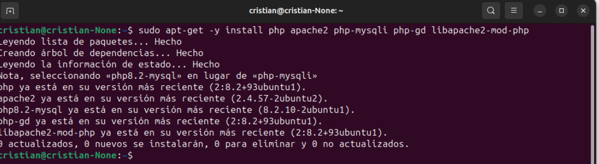

2. comprobar el estado de apache2
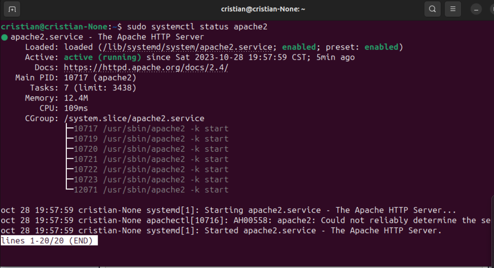
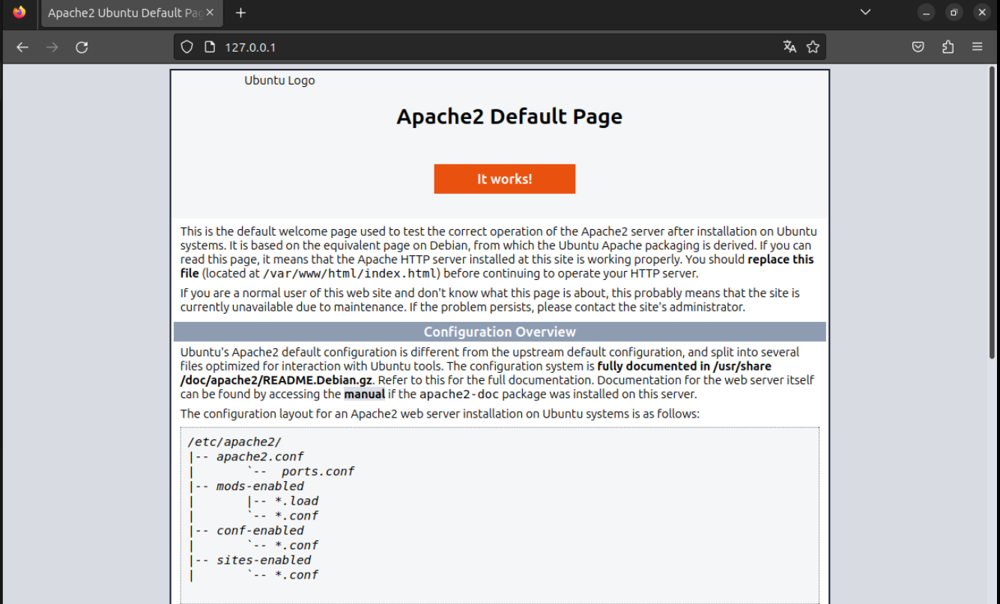

3. Buscaremos el repositorio oficial de DVWA en github y copiamos el enlace 
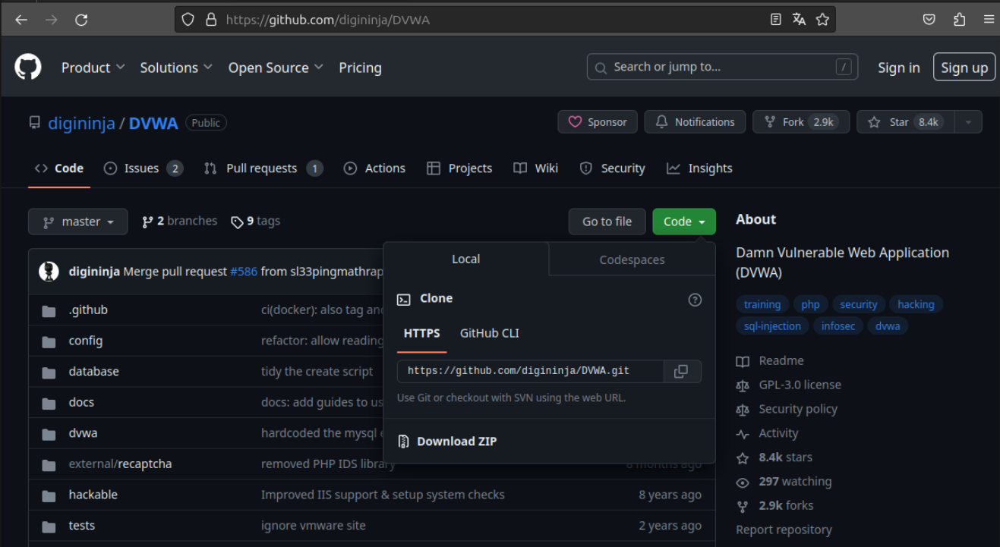

4. Nos ubicamos en el directorio predeterminado de apache, donde se almacenan los sitios web (tambien conocido como directorio raiz o DocumentRoot)
```cd /var/www/html```
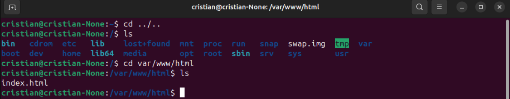
(Este index es la vista de apache2)

5. A continuacion clonar el repositorio de DVWA con el enlac000-default.confe previamente copiado.
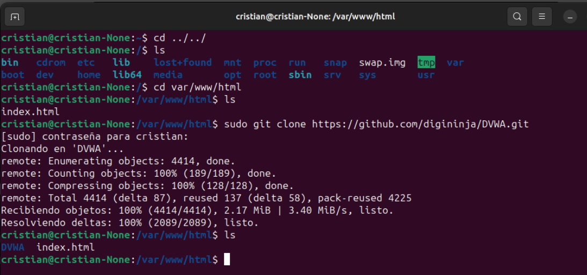

verificaremos que todo este correcto hasta este punto
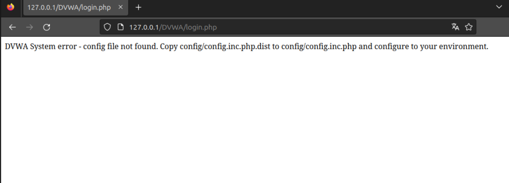

6. Pasaremos a crear / configurar la base de datos y el archivo config.inc.php de apache2
verificar las credenciales de la base de datos en el archivo de configuracion.
```sudo apt-get install mariadb-server```
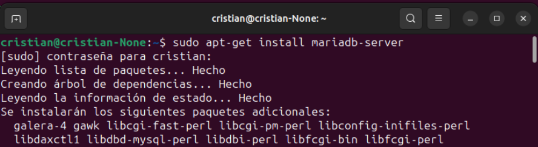
``` sql
sudo mysql -u root

CREATE USER 'dvwa'@'localhost' IDENTIFIED BY 'password';

GRANT ALL PRIVILEGES ON *. * TO 'dvwa'@'localhost';

CREATE DATABASE dvwa;

GRANT ALL PRIVILEGES ON dvwa. * TO 'dvwa'@'localhost';

FLUSH PRIVILEGES;
```
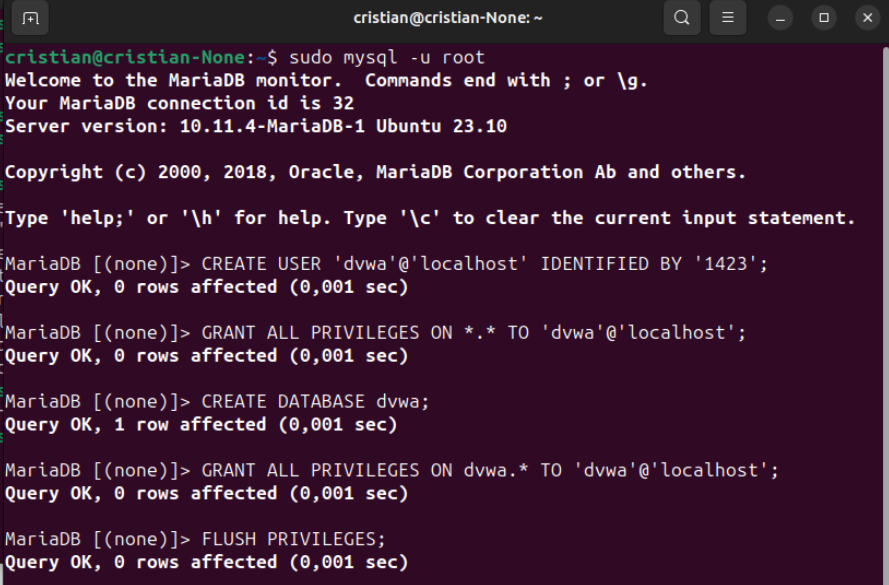
(En este ejemplo posteriormente se actulizo la contraseña de '1423' a 'password')
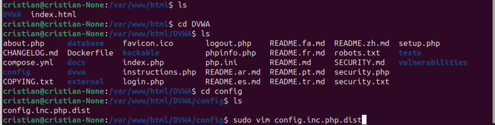
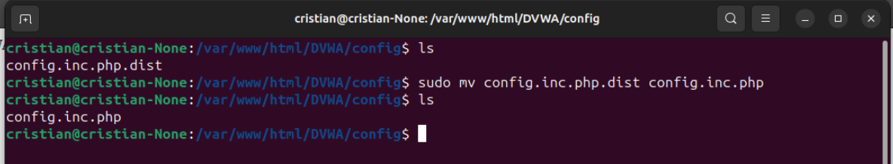
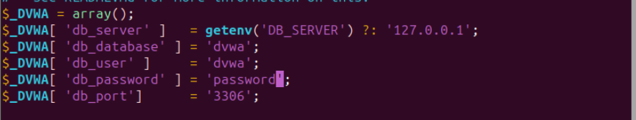


7. Comprobar que carge correctamente el login de DVWA.

(si las credenciales estan correctas y el menu de DVWA no lo reconoce, reiniciar el equipo)


8. Crear un VirtualHost para facilitar el acceso 

...


